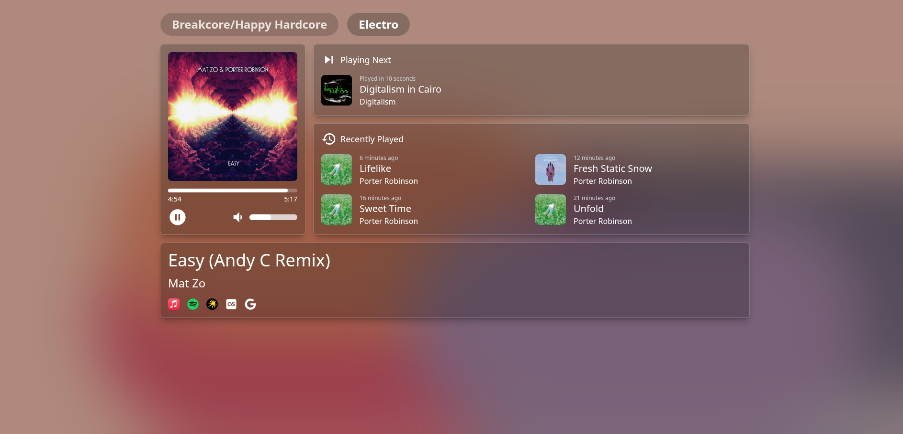

# azuracastui

To install dependencies:

```bash
bun install
```

To run:

copy `.env.sample` to `.env` and edit azuracast API Base URL env

```bash
bun run build
python -m http.server -d dist/ # or serve files from dist via nginx
```

